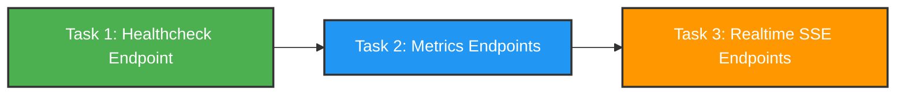
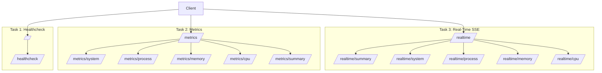

# 🌐 [Axum Web Servers | Rust Workshop](https://rust.ipworkshop.ro/docs/web_server/)


A hands-on **Rust workshop project** where I built a HTTP server using [`Axum`](https://docs.rs/axum/latest),
exposing **health checks, system metrics and real-time monitoring** of the Operating System.


## 📚 Learning Goals

By completing this workshop, I've gained experience with:
- Building **REST APIs** in Rust
- Designing **real-time web servers** with `SSE`
- Collecting and serializing system metrics
- Organizing scalable `Axum` projects
- How a **system monitor** works





## 📦 Prerequisites

- [Install Rust](https://www.rust-lang.org/tools/install)
- [Rust](https://www.rust-lang.org/) (latest stable recommended)
- Cargo package manager (bundled with Rust)

Install Rust:
```sh
curl --proto '=https' --tlsv1.2 -sSf https://sh.rustup.rs | sh
```

Verify installation:

```sh
rustc --version
cargo --version
```

## 🚀 Getting Started

Clone repo and run:
```sh
cargo run
```

Visit <http://localhost:8080> to confirm it’s working.


To build in **release mode**:

```sh
cargo build --release
./target/release/upb-rust-workshop
```

## 🔗 API Endpoints





### 🩺 Task 1: Healhcheck
- [/](http://localhost:8080/) -> Hello World
- [/healthcheck](http://localhost:8080/healthcheck)

### 📊 Task 2: Metrics
- [/metrics](http://localhost:8080/metrics)
- [/metrics/system](http://localhost:8080/metrics/system)
- [/metrics/process](http://localhost:8080/metrics/process)
- [/metrics/memory](http://localhost:8080/metrics/memory)
- [/metrics/cpu](http://localhost:8080/metrics/cpu)
- [/metrics/summary](http://localhost:8080/metrics/summary)

### ⚡ Task 3: Real-Time (`SSE`)
- [/realtime](http://localhost:8080/realtime)
- [/realtime/summary](http://localhost:8080/realtime/summary)
- [/realtime/system](http://localhost:8080/realtime/system)
- [/realtime/process](http://localhost:8080/realtime/process)
- [/realtime/memory](http://localhost:8080/realtime/memory)
- [/realtime/cpu](http://localhost:8080/realtime/cpu)
- [/realtime/summary](http://localhost:8080/realtime/summary)


## 🛠️ Crates Used

- [axum](https://docs.rs/axum/latest/axum/) - Web framework
- [tokio](https://docs.rs/tokio/latest/tokio/) - Async runtime
- [sysinfo](https://docs.rs/sysinfo/latest/sysinfo/) - System metrics
- [serde](https://docs.rs/serde/latest/serde/) - Serialization
- [serde_json](https://docs.rs/serde_json/latest/serde_json/) - JSON handling

